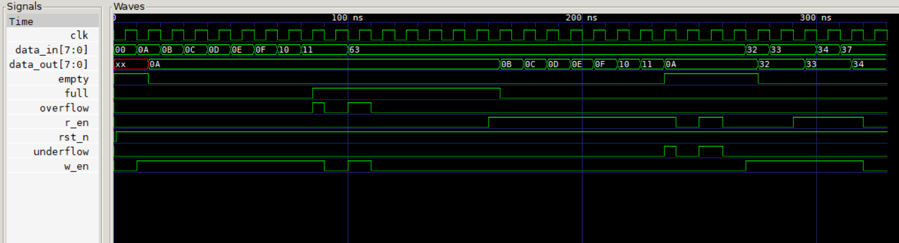
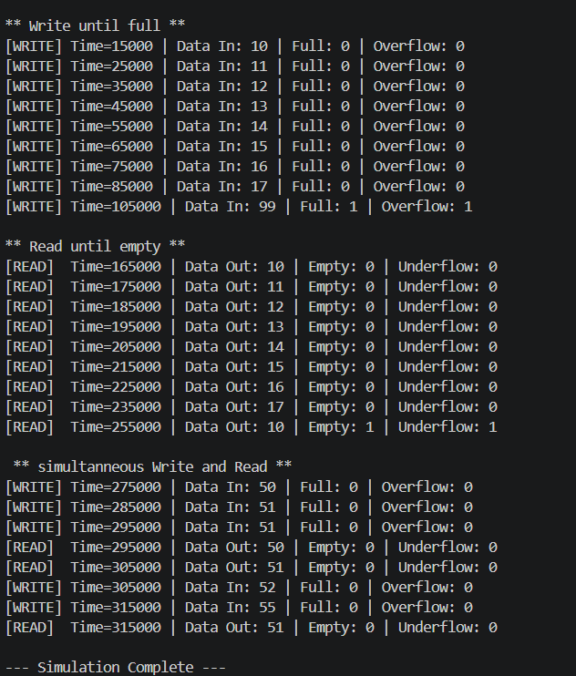

# Synchronous FIFO (First-In-First-Out)

## Introduction
A Synchronous FIFO is a hardware data buffer where both the write operations and read operations are governed by the exact same clock signal. Because data enters and exits within a single, unified clock domain, it does not require complex synchronization logic to prevent metastability. 

It is a fundamental digital design component used to safely buffer data, manage flow control, and handle temporary disparities in data rates between a producer and a consumer operating on the same clock.

---

**Synchronous FIFO TL;DR**

* **Core Function:** A hardware buffer that temporarily stores data being passed between two modules sharing the same clock domain.
* **The Problem (Flow Control):** A data producer may generate bursts of data faster than a consumer can process them. A FIFO absorbs these bursts.
* **Binary Pointers:** Read and write address pointers use standard binary counters, as there is no risk of multi-bit transition errors within a single clock domain.
* **Exact Flags:** Because everything is synchronous, `full, overflow, underflow` and `empty` flags are generated exactly and immediately, without the pessimistic delays seen in asynchronous designs.
* **Status Counter:** Often utilizes a single internal counter tracking the number of items currently in the FIFO, making flag generation straightforward.
* **Standard Verification:** Behavior can be thoroughly verified using standard sequential procedural blocks in a testbench.

---

## Importance and Features

- **Elastic Buffering:** Absorbs transient data bursts, preventing the transmitting module from stalling the entire pipeline.
- **Simplified Timing:** Since read and write operations share a clock edge, setup and hold times are easily met using standard synthesis constraints.
- **Throughput Optimization:** Keeps data pipelines full and active, ensuring that downstream processors or ALUs always have data available to process.
- **Flow Control Management:** Generates exact flags to tell the producer when to pause and the consumer when to wait.

---

## Architecture

- **Dual-Port Memory (RAM):** The core storage array that allows simultaneous reading and writing on the same clock cycle.
- **Write/Read Pointers:** Binary counters that track the next memory address to write to or read from. They wrap around to zero upon reaching the maximum address, creating a circular buffer.
- **Status Counter:** An internal register that increments on a write, decrements on a read, and remains unchanged if both happen simultaneously. 
- **Flag Logic:** Combinational logic that continuously monitors the status counter (or compares pointer addresses) to immediately assert `full`, `empty`, `overflow`, or `underflow` signals.

---

## Use Cases

**Pipelined Data Processing** → Buffering intermediate results between different stages of an ALU or DSP pipeline.

**Instruction Queues** → Storing fetched instructions in a CPU before they are decoded and executed.

**On-Chip Bus Interfaces (AXI/AHB)** → Managing data flow in memory-mapped or streaming interfaces (like AXI4-Stream) within a single System-on-Chip (SoC) clock domain.

**Sensor Data Aggregation** → Collecting sequential readings from an internal sensor interface before a microcontroller interrupt reads the batch.

---

## Need for a Well-Designed Synchronous FIFO

While simpler than its asynchronous counterpart, a poorly designed Synchronous FIFO can still severely bottleneck a system. A robust design ensures:

- **True Simultaneous Read/Write** → Handling the corner case where the FIFO is full and a simultaneous read/write occurs (data should be accepted and the FIFO should remain full).
- **Exact Flag Timing** → Generating flags cleanly without 1-cycle delays, ensuring that no clock cycles are wasted waiting for flags to update.
- **Resource Efficiency** → Utilizing internal FPGA Block RAMs (BRAMs) or efficient ASIC register files rather than wasting massive amounts of distributed logic for storage.

---

## Relevance to My Work

As I build synchronous data paths and process internal signals, the Synchronous FIFO is the standard mechanism for flow control. 

- Connecting different processing modules within the same subsystem without losing data during processing stalls.
- Creating standard AXI-Stream buffers for IP cores.
- Serving as a fundamental stepping stone to understanding circular buffers before tackling complex, multi-clock domain architectures.

---

## Design Choice: Parameterized Data Width and Depth

The FIFO is designed using a parameterized data width (`DATA_WIDTH`) and address depth (`ADDR_WIDTH`). 
This highly scalable approach allows the exact same module to be instantiated as a tiny buffer for a state machine, or a massive block RAM buffer for image processing, vastly improving code reusability without rewriting core logic.

---

## Module Declaration

```verilog
module sync_fifo #(parameter DATA_WIDTH = 8,
parameter ADDR_WIDTH = 3)(
    input  wire clk, rst_n,
    input  wire w_en, r_en,
    input  wire [DATA_WIDTH-1:0] data_in,
    output wire [DATA_WIDTH-1:0] data_out,
    output wire full, empty, underflow, overflow
);
```

## Waveform and Output
Waveform analysis confirms correct synchronous circular buffer behavior, including simultaneous read/write operations without data loss. Design verified successfully across all tested parameter configurations.




## Key Learnings & Verification Techniques

Building this Synchronous FIFO provided a solid foundation in sequential logic design, flow control, and circular buffer mechanics:

* **Circular Buffer Implementation**
    I learned how to manage memory addresses efficiently. By allowing the binary read and write pointers to naturally overflow back to zero, the linear memory array behaves like an infinite loop, continuously overwriting old, read data with new incoming data.

* **Exact Flag Generation & Corner Cases**
    Unlike an asynchronous FIFO where flags are pessimistic, I learned to generate exact `full, overflow ,underflow` and `empty` flags. A critical learning moment was handling the simultaneous read/write condition: if the FIFO is full and a read and write occur on the exact same clock edge, the FIFO must seamlessly accept the new data, output the old data, and remain full. 

* **Status Tracking Methods**
    I explored two different architectural approaches: using a dedicated counter to track the number of elements (easier flag logic but can be a timing bottleneck in fast designs), versus utilizing an extra bit on the pointers to distinguish between full and empty conditions when the pointer addresses match. 

* **Synchronous Testbench Verification**
    Because the entire system runs on a single clock edge, I learned how to effectively write sequential testbenches. I created targeted tasks to push data until overflow, pop data until underflow, and randomly assert read/write enables to verify absolute reliability under unpredictable data traffic.
